

  

## Introduction
### CREATE A FREE APP FOR YOUR TEAM

CricMates App is a platform that allows your cricket teams to improve communication by creating their own smartphone app, events, availabilities, team selection and more.

Design your app, choose from a huge range of features and you will have a fully functional CricMates App created in less than 5 minutes

## Features/Modules
### Login
Simple login with credentials or finger print login

  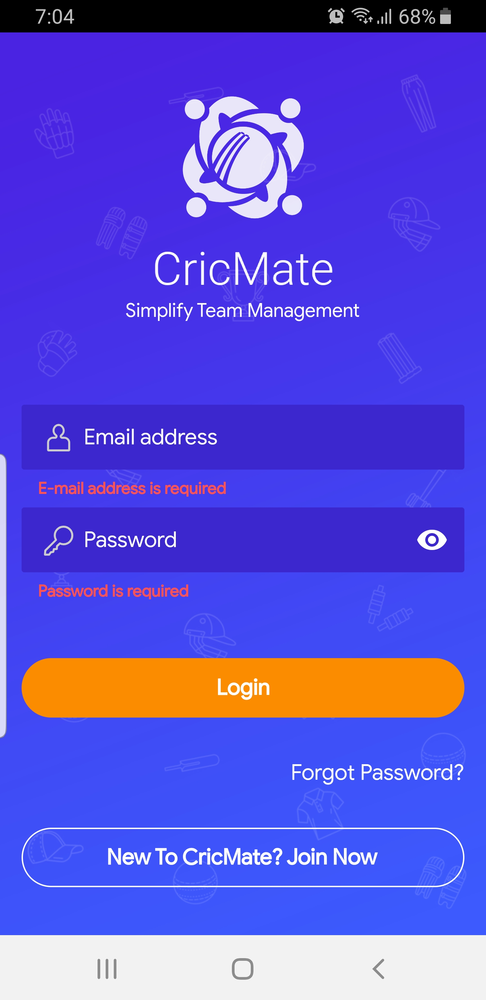

### Forgot Password
With help of this module player/user can change their forgotten password with email OTP

  

### Home
This is the landing page for user

  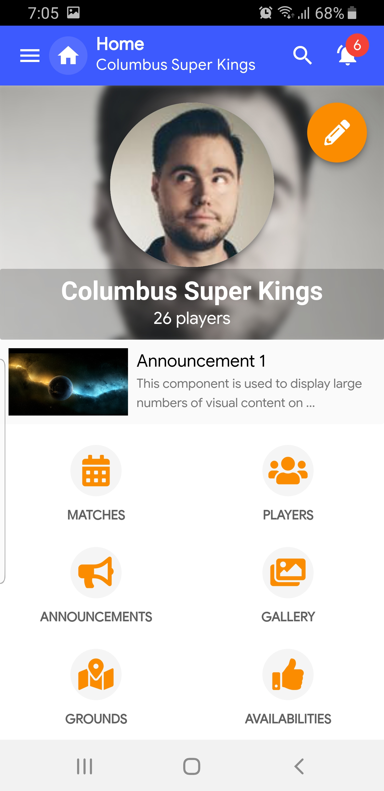

### Matches
Player can see list of past and upcomming matches with list and calendar view.
## Screenshots

Match list view | Match Calendar View
-------|---------------
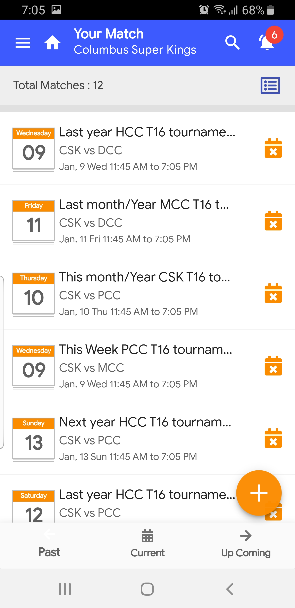 | 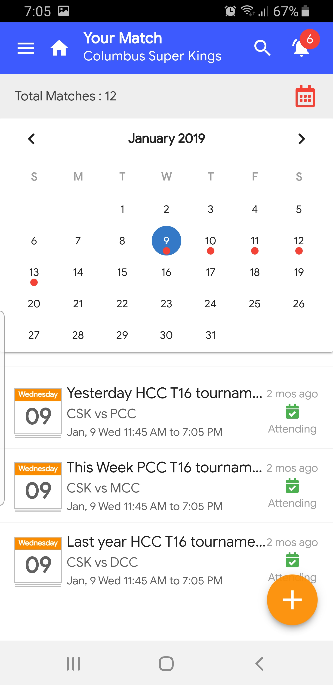 
Match Details| Match RSVP
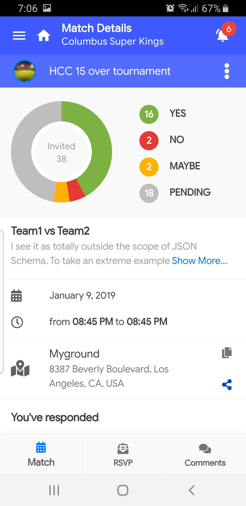 | 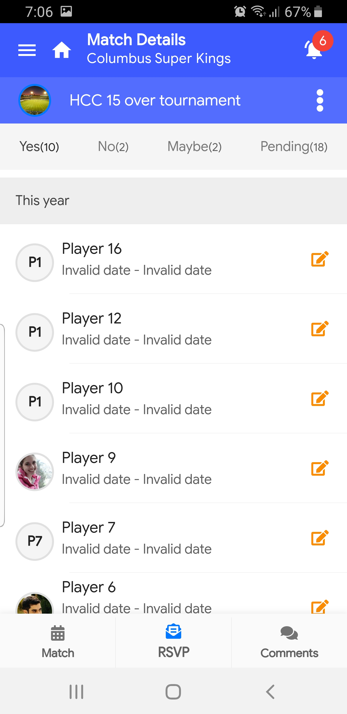 
Match Comments
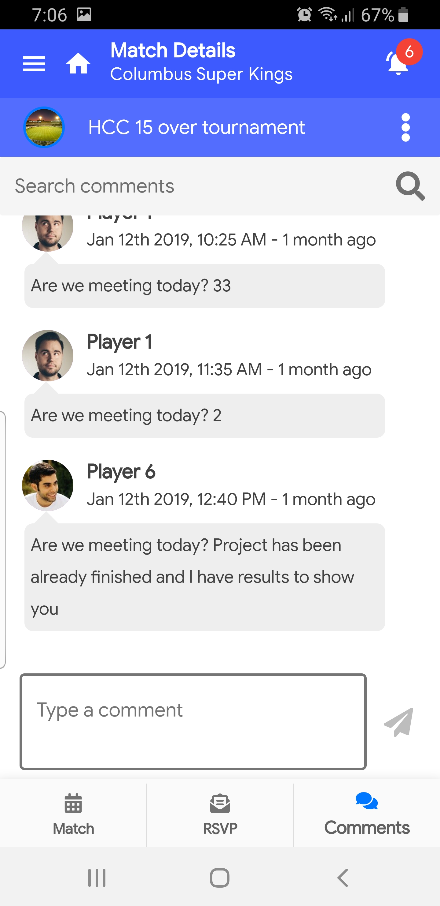

### Players
View list of players added in your team and admin/captain can add/remove players to/from team. Can see selected player's full profile such as Phone no, email, address, batting/bowling/fielding style and jersey details as well.

Player list | Player Profile
-------|---------------
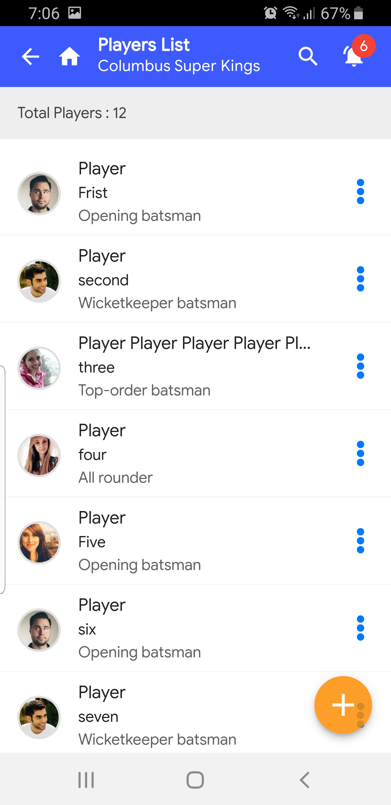 | 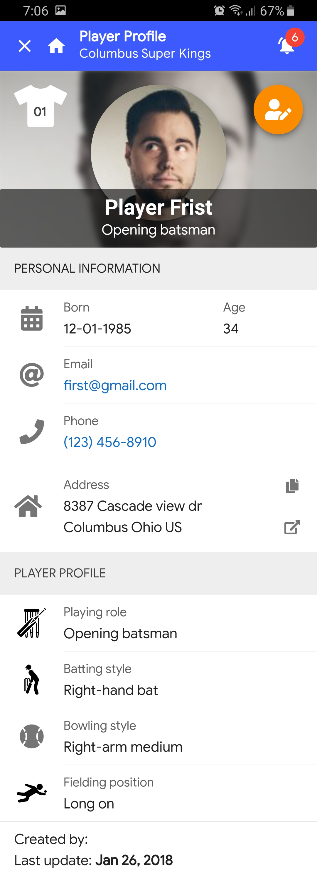 

### Announcements
Player can receive and view the announcements

Announcements list | Create Announcement
-------|---------------
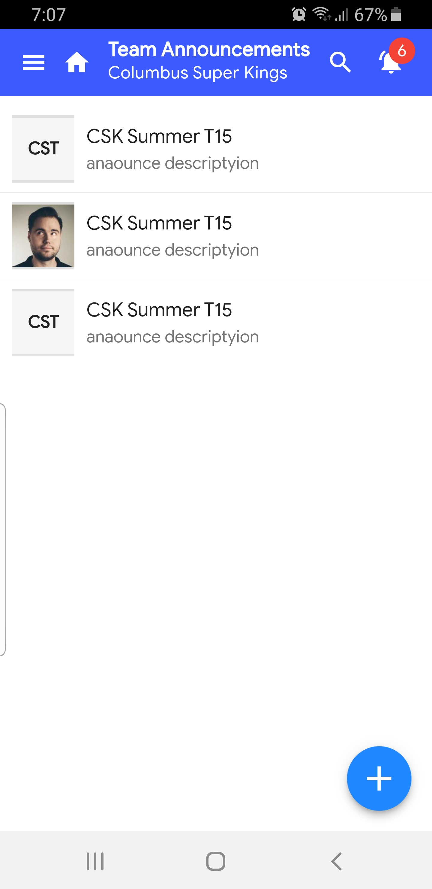 | 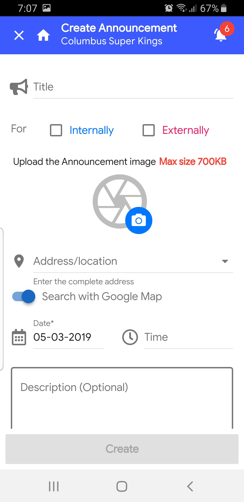 